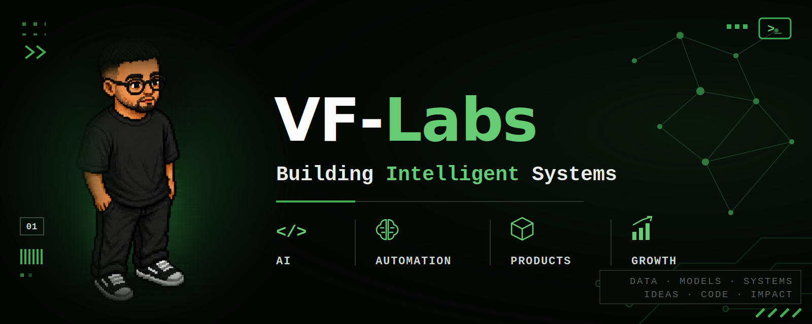

<div align="center">



<br/>
<br/>

[](https://victorfiallho.github.io)
[](https://br.linkedin.com/in/victor-fialho-9140b23b5)
[](https://leetcode.com/u/VictorFialho)

</div>

<br/>

```bash
$ whoami

Victor Fialho — 20 · Brasília, Brazil 🇧🇷
AI Engineering @ IESB (one of Brazil's first bachelor's programs in the field)
Founder @ AoTomate Sistemas

I don't just study automation — I build it, ship it,
and debug it in production for real clients.

$ cat languages.txt
PT (native) · EN (fluent) · ES (advanced)

$ cat off_duty.txt
Jiu-Jitsu · philosophy of mind · history of mathematics
```

<br/>

## `>_` What I'm building

### Hera Remoto — Multi-Tenant WhatsApp AI Agent

Flagship AoTomate system: an AI customer service agent built for a remote secretarial company, **live in production**. End-to-end ownership — architecture, deployment, monitoring, and production debugging.

```
┌─ STACK ──────────────────────────────────────────────────┐
│  N8N · Evolution API · Supabase · Groq (Llama 3.3 70B)   │
│  Oracle Cloud (2 VMs)                                    │
└──────────────────────────────────────────────────────────┘
```

- **What it does:** answers inbound WhatsApp messages 24/7 in seconds, routes conversations per tenant, escalates to humans only when needed
- **Engineering highlights:**
  - Diagnosed and fixed a production-breaking change in Meta's `remoteJid` → `@lid` GUID format that silently broke message routing in Evolution API
  - Multi-tenant message routing with hardened Supabase RLS policies
  - Zero-marginal-cost inference pipeline — migrated from Claude API to Groq free tier
- **Code:** private (client production system) · architecture writeup available on request

`STATUS: ● LIVE`

<br/>

### Sels UCOB — Order Management System

Full-stack system built for a real organization (União Centro Oeste Brasileira). Complete order lifecycle — request → warehouse separation → shipment → delivery — with role-based access and photo evidence at each stage.

```
┌─ STACK ──────────────────────────────────────────────────┐
│  Next.js 15 · React 19 · TypeScript · Supabase           │
│  Tailwind CSS 4 · shadcn/ui · Vercel CI/CD               │
└──────────────────────────────────────────────────────────┘
```

- **Features:** multi-role auth (admin/operator), real-time inventory and shipment tracking, report generation, photo uploads
- **Deploy:** [sistema-gestao-pedidos.vercel.app](https://sistema-gestao-pedidos.vercel.app)

`STATUS: ● LIVE`

<br/>

### Portuguese Sentiment Classifier

NLP pipeline for sentiment analysis in Brazilian Portuguese — classical ML from scratch, no pre-trained models. Corpus preprocessing → TF-IDF → Logistic Regression, with focus on PT-BR text normalization, class imbalance, and model interpretability.

```
┌─ STACK ──────────────────────────────────────────────────┐
│  Python · scikit-learn · pandas · NLTK                   │
└──────────────────────────────────────────────────────────┘
```

- **Code:** [github.com/Victorfiallho](https://github.com/Victorfiallho)

<br/>

## `>_` AoTomate Sistemas

The venture under VF-Labs. I build custom AI agents, WhatsApp automation pipelines, and management systems engineered around each client's actual operation — no templates, no bloat. First client live in production; building toward a SaaS product.

→ More at [victorfiallho.github.io](https://victorfiallho.github.io)

<br/>

## `>_` Stack

**AI & Automation**


**Frontend**


**Backend & Data**


**Infra**


<br/>

## `>_` Stats

<div align="center">


</div>

<br/>

<div align="center">

`DATA · MODELS · SYSTEMS · IDEAS · CODE · IMPACT`

</div>
