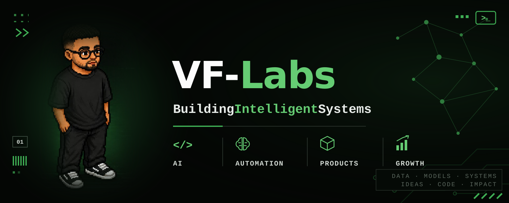

  

   

>_ whoami

Victor Fialho · Anápolis, Brazil 🇧🇷
AI Engineering @ UniEVANGÉLICA
Founder @ AoTomate Sistemas · Automation Analyst @ DataCrazy CRM

I build AI agents, automation pipelines, and full-stack systems for real operations. My work spans architecture, implementation, deployment, monitoring, and production debugging — from multi-tenant WhatsApp agents to retrieval systems with evaluation suites.

languages  PT (native) · EN (fluent) · ES (advanced)
off-duty  Jiu-Jitsu · philosophy of mind · history of mathematics

>_ Featured projects

Hera Remoto — Multi-Tenant WhatsApp AI Agent

LIVE IN PRODUCTION · Flagship AoTomate system

AI customer-service agent built for a remote secretarial company. I own the system end to end: architecture, deployment, monitoring, and production debugging.

Stack: n8n · Evolution API · Supabase · Groq / Llama 3.3 70B · Oracle Cloud

Answers inbound WhatsApp messages 24/7 and escalates conversations when human support is needed

Routes conversations across tenants with hardened Supabase Row Level Security policies

Diagnosed and fixed a production-breaking migration from Meta's remoteJid format to @lid GUIDs

Migrated the inference pipeline from Claude API to Groq to reduce operating costs

Source: Private client system · Architecture write-up available on request

Sels UCOB — Order Management System

LIVE IN PRODUCTION · Full-stack system for União Centro Oeste Brasileira

Manages the complete order lifecycle, from request and warehouse separation to shipment and delivery.

Stack: Next.js 15 · React 19 · TypeScript · Supabase · Tailwind CSS 4 · shadcn/ui · Vercel

Multi-role authentication for administrators and operators

Real-time inventory, order, and shipment tracking

Report generation and photo evidence at each operational stage

Multi-module architecture with 65+ commits and automated deployment

Live: sistema-gestao-pedidos.vercel.app

RAG Agent — Retrieval-Augmented Q&A with Evaluation

IN PROGRESS · Production-shaped retrieval system

A document Q&A pipeline covering ingestion, embeddings, retrieval, grounded generation, and systematic evaluation. The evaluation harness measures both retrieval quality and answer faithfulness.

Stack: Python · LangChain · pgvector / Supabase · Claude API · Custom evaluation harness

End-to-end ingestion and semantic retrieval pipeline

Grounded responses backed by retrieved context

Retrieval and faithfulness metrics designed for repeatable evaluation

Built around production concerns rather than a tutorial-only implementation

Source: Private during active development · Technical write-up available on request

Orçador — Pricing & Scope Engine

IN PROGRESS · Internal product for AoTomate Sistemas

Turns a client brief into structured pricing and scope output using service-tier rules and LLM-generated JSON. It is also my learning-by-building vehicle for understanding every layer of a full-stack product.

Stack: JavaScript · React / Next.js · Supabase / SQL · Claude API · Vercel

Converts unstructured client requirements into predictable JSON output

Applies service-tier and pricing rules to generate proposals consistently

Covers HTTP fundamentals, data modeling, backend integration, frontend development, and deployment

Source: github.com/Victorfiallho/orcador

>_ AoTomate Sistemas

AoTomate is the venture inside VF-Labs. I design custom AI agents, WhatsApp automation pipelines, and management systems around each client's actual operation — with a focus on reliability, maintainability, and measurable operational value.

The first client system is already live in production, and the next step is turning repeated solutions into a scalable SaaS product.

→ Explore AoTomate and my complete portfolio

>_ Current focus

[NOW ] RAG systems       embeddings · retrieval · evaluation · faithfulness
[NOW ] Agentic AI       orchestration · tool use · reliable workflows
[NOW ] Full-stack       JavaScript · SQL · React/Next.js · deployment
[NOW ] AI Engineering   calculus · linear algebra · computer science
[NEXT] Cloud            AWS AI Practitioner certification track

>_ Tech stack

AI & Automation

Application Development

Data & Infrastructure

>_ GitHub activity

  
  

>_ Let's build something useful

I'm open to AI engineering opportunities, technical collaborations, and conversations about applied AI, automation, and production systems.

Portfolio · LinkedIn

   

DATA · MODELS · SYSTEMS · IDEAS · CODE

